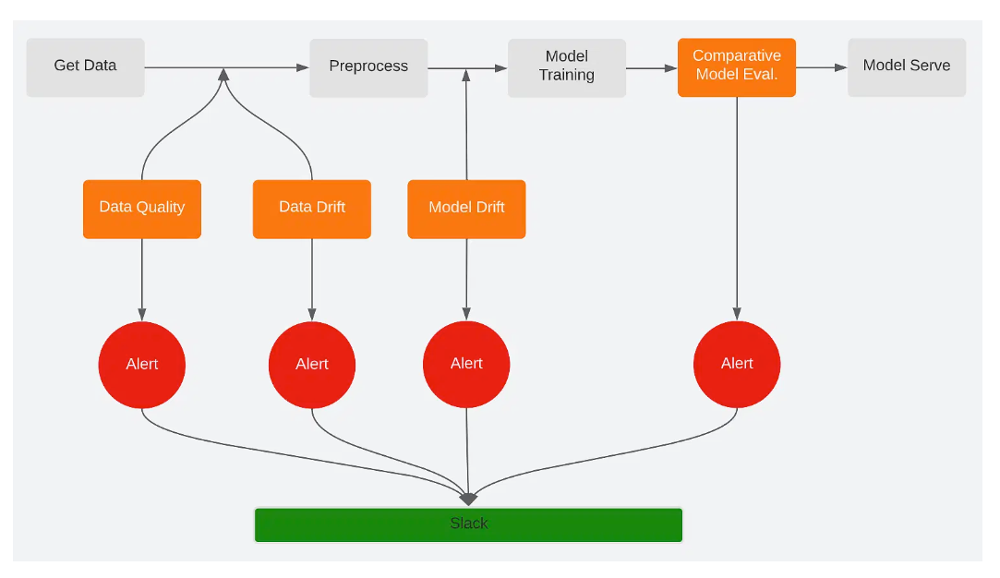

# Loan Prediction and Monitoring Pipeline

## Overview
This project is an extension of my data mining class project where I have done extensive hypothesis testing and statistical analysis. In this MLOps project, we build an end-to-end pipeline to monitor any changes in the predictive power of the model or degradation in data quality. The pipeline ensures the stability and reliability of the loan prediction model in a production environment.

The project demonstrates:
- Concept, Data, and Model Drift monitoring.
- End-to-end orchestration of machine learning workflows using Airflow and Docker.

---

## Learning Outcomes
By completing this project, you will learn:

1. How to connect Python to a PostgreSQL server.
2. Conditional extraction of data from PostgreSQL.
3. Data preprocessing techniques:
   - Missing Value Imputation
   - Rescaling Data
   - Feature Engineering
4. Checking data sanity and building predictive models:
   - Random Forest
   - Gradient Boosting
5. How to generate and interpret model deployment reports.
6. Concepts and monitoring techniques for:
   - Concept Drift
   - Data Drift
   - Model Drift
7. Setting up Docker and Docker Compose.
8. Configuring Slack notifications in Airflow.
9. Creating and orchestrating DAGs in Airflow.

---

## Project Description

### **Overview**
After developing a machine learning model with high accuracy using raw data, it’s essential to monitor its performance in production. Factors like data changes, feature drift, and model drift can affect the model’s accuracy over time. Monitoring and addressing these changes ensure the model remains effective in solving business problems.

This project builds an end-to-end monitoring pipeline for a loan prediction model that classifies whether a loan should be approved or rejected. The pipeline integrates monitoring and orchestration capabilities using Docker and Airflow.

### **Aim**
- Build a loan eligibility classification model.
- Monitor Concept Drift, Data Drift, and Model Drift.
- Orchestrate the monitoring pipeline using Airflow.

### **Tech Stack**
- **Language**: Python
- **Libraries**: pandas, numpy, matplotlib, scikit-learn, deepchecks, sqlalchemy, psycopg2-binary
- **Services**: Airflow, Docker, PostgreSQL

---

## Workflow Diagram
Below is the visual representation of the pipeline workflow:



The pipeline involves:
1. **Get Data**: Extract data from PostgreSQL.
2. **Data Quality Checks**: Validate data integrity.
3. **Preprocess**: Handle missing values, rescale data, and engineer features.
4. **Data Drift and Model Drift Checks**: Monitor changes in data and model performance.
5. **Model Training**: Build and evaluate Random Forest and Gradient Boosting models.
6. **Comparative Model Evaluation**: Compare models for deployment.
7. **Alerts**: Trigger Slack notifications for anomalies or drift detection.

---
### Note: This project requires the data to be present in postgres server.

The data is available in code>main>dags>data>raw location.

Kindly upload the data and provide the appropriate credentials in code>main>dags>creds.json file.

##  What's new?

ML pipeline monitoring using:

- Deepcheks
- Airflow
- Slack integration: alerts  

## Step-by-step Approach
1. **Data Extraction**
   - Extract data from the PostgreSQL database.
2. **Preprocessing**
   - Handle missing values.
   - Encode categorical variables.
   - Rescale and engineer new features.
3. **Model Training**
   - Train Random Forest and Gradient Boosting models.
   - Evaluate model performance.
4. **Monitoring**
   - Monitor Concept, Data, and Model Drift using deepchecks.
5. **Pipeline Orchestration**
   - Use Airflow DAGs to automate and monitor the pipeline.

---

## How to Run the Pipeline

1. **Setup PostgreSQL Database**:
   - Create an Amazon Aurora RDS instance with a PostgreSQL database in AWS.
   - Configure the security group to accept TCP data on port `5432`.

2. **Update Credentials**:
   - Add your database credentials in the `creds.json` file located in the `dags` directory.

3. **Restore Data**:
   - Use tools like **pgAdmin** or **DBeaver** to restore the data backup file from the `postgres_file` directory.
   - Ensure all tables are properly restored in the PostgreSQL database.

4. **Setup Docker Environment**:
   - Create the following directories:
     ```bash
     mkdir logs plugins jobs
     ```
   - While in the same home directory as `docker-compose.py` start docker-compose by issuing this command on you terminal: `docker-compose up`
   - This will take a couple of minutes to boot up all containers. To check if all containers are running properly, you can run `docker ps --all`. You should see a list of all containers in `healthy` status

   ```
      CONTAINER ID   IMAGE                   COMMAND                  CREATED         STATUS                    PORTS                               NAMES
      5dea90526ec4   apache/airflow:2.2.4    "/usr/bin/dumb-init …"   23 hours ago    Up 23 hours (healthy)     8080/tcp                            project_01_model-testing_airflow-scheduler_1
      b27cf17c76d4   apache/airflow:2.2.4    "/usr/bin/dumb-init …"   23 hours ago    Up 23 hours (healthy)     8080/tcp                            project_01_model-testing_airflow-triggerer_1
      b254faa326cb   apache/airflow:2.2.4    "/usr/bin/dumb-init …"   23 hours ago    Up 23 hours (healthy)     0.0.0.0:5555->5555/tcp, 8080/tcp    project_01_model-testing_flower_1
      79af795c2ab2   apache/airflow:2.2.4    "/usr/bin/dumb-init …"   23 hours ago    Up 23 hours (healthy)     8080/tcp                            project_01_model-testing_airflow-worker_1
      cfe8d1b18f77   apache/airflow:2.2.4    "/usr/bin/dumb-init …"   23 hours ago    Up 23 hours (healthy)     0.0.0.0:8080->8080/tcp              project_01_model-testing_airflow-webserver_1
      c68fc80dbf0d   postgres:13             "docker-entrypoint.s…"   23 hours ago    Up 23 hours (healthy)     5432/tcp                            project_01_model-testing_postgres_1
      5c0b9f136b75   redis:latest            "docker-entrypoint.s…"   23 hours ago    Up 23 hours (healthy)     6379/tcp                            project_01_model-testing_redis_1
   ```

5. **Configure Airflow Slack Connections**:
   - Open the Airflow Webserver UI.
   - Address errors for Slack connection:
     - Create a Slack account and visit [Slack API](https://api.slack.com/apps).
     - Create a new app:
       - Click "From Scratch," give your app a name, and select your workspace.
       - Add the following scopes to the app:
         - `chat:write`
         - `chat:write:public`
       - Install the app into the workspace.
     - Copy the **Bot User OAuth Token**.
     - In Airflow, go to **Connections** and create:
       1. Connection ID: `slack`
          - Connection Type: Slack Webhook
          - Login: `#airflow` (or any existing Slack channel)
          - Password: **OAuth Token**
       2. Connection ID: `slack_connection`
          - Connection Type: Slack Webhook
          - Same Login and Password as above.
     - Ensure the Slack channel exists before adding it to Airflow connections.

6. **Test Slack Integration**:
   - Run the `slack_test_workflow` DAG.
   - Resolve any errors, such as "channel not found," by verifying the Slack channel.

7. **Run ML Monitoring Pipeline**:
   - Execute the `ml_monitoring_pipeline` DAG to monitor the machine learning pipeline.

---

## Setup Instructions

1. **Prerequisites**:
   - Install [Docker](https://docs.docker.com/get-started/) and [Docker Compose](https://docs.docker.com/get-started/08_using_compose/).
   - Ensure access to a PostgreSQL server with required data.
   - Basic experience with training a machine learning model using scikit-learn or xgboost
   - Basic experience with serving a pretrained using flask
   - Basic familiarity with Postgressql
   - Experience with docker and docker-compose
   - Basic statistics on hypothesis testing

2. **Environment Setup**:
   - Clone the repository:
     ```bash
     git clone https://github.com/your-repo.git
     ```
   - Navigate to the project directory:
     ```bash
     cd loan-prediction-monitoring
     ```
   - Build and start containers:
     ```bash
     docker-compose up
     ```

3. **File Preparation**:
   - Place raw data in `dags/data/raw/`.
   - Update `creds.json` with PostgreSQL credentials.

4. **Reset Environment (if needed)**:
   - Clear files under:
     - `dags/data/raw/`
     - `dags/data/preprocessed/`
     - `dags/models/`
     - `dags/results/`
   - Restart Airflow:
     ```bash
     docker-compose down && docker-compose up
     ```

---

## File Structure
1. Delete all files under the following subdirectories. In case subdirectories do not exist (due to .gitignore) please create them

   - `dags/data/raw/*`
   - `dags/data/preprocessed`
   - `dags/models`
   - `dags/results`

   At the end, the directory should be structured as following (ensure to manually create any directory that is missing)

   ```
       ├── airflow.sh
       ├── dags
       │   ├── app.py
       │   ├── credentials.json
       │   ├── dag_pipeline.py
       │   ├── dag_training.py
       │   ├── data
       │   │   ├── preprocessed
       │   │   │   ├── 
       │   │   └── raw
       │   │       ├── 
       │   ├── main.py
       │   ├── models
       │   │   ├── deploy_report.json
       │   ├── results
       │   │   ├── 
       │   ├── src
       │   │   ├── config.py
       │   │   ├── drifts.py
       │   │   ├── etl.py
       │   │   ├── helpers.py
       │   │   ├── inference.py
       │   │   ├── preprocess.py
       │   │   ├── queries.py
       │   │   └── train.py
       ├── docker-compose.yaml
       ├── jobs
       ├── logs
       │   ├── 
       ├── plugins
       ├── readme.md
       └── requirements.txt
   ```
2. Truncate the `mljob` table

   - `truncate mljob;`

## Contributions

This project was completed under the guidance of:

- Tyler Conlon, Big Data and Cloud Architecture Professor.

- Sumona Mondal, Mathematics Chair.
